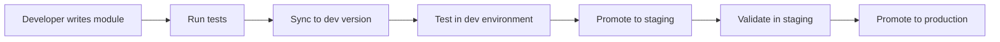

# Module Versioning and Deployment Architecture

## Overview

This document outlines the future architecture for module versioning and deployment in the transformation pipeline system. The design separates business/runtime concerns from developer/deployment operations while preparing for future versioning capabilities.

## Current State vs Future Vision

### Current State (2024)
- Single version per module
- Modules stored in database via sync command
- Registry holds module classes in memory
- No versioning or rollback capabilities

### Future Vision
- Multiple versions per module with immutable deployments
- Content-addressed storage for module artifacts
- Blue-green and canary deployment strategies
- Full rollback and audit capabilities

## Architecture Components

### 1. Dual-Service Architecture

#### ModuleRuntimeService (Business/Runtime)
**Purpose**: Handle all runtime operations for module execution and catalog queries

**Key Responsibilities**:
- Get module catalog from database
- Execute modules using specific versions
- Provide module information to API layer
- Read-only operations from business perspective

**Key Methods**:
```python
- get_module_catalog(version_tag: str = "latest")
- get_module_info(module_id: str, version: str = "latest")
- execute_module(module_id: str, version: str, inputs, config, context)
- get_module_stats()
```

#### ModuleDeveloperService (Developer/Deployment)
**Purpose**: Handle module registration, versioning, and deployment operations

**Key Responsibilities**:
- Sync modules from code to database
- Store module artifacts immutably
- Manage version tags and promotions
- Handle rollback operations

**Key Methods**:
```python
- sync_modules(packages: List[str], version_tag: str = "dev")
- promote_version(from_tag: str, to_tag: str)
- rollback_version(version_tag: str, to_previous: str)
- create_module_snapshot(module_id: str)
```

### 2. Module Persistence Strategy

#### Content-Addressed Storage
Inspired by Git and IPFS, each module version is stored with a content hash (SHA-256).

**Benefits**:
- Immutable module artifacts
- Deduplication of identical modules
- Cryptographic verification of module integrity
- Easy rollback to any previous version

#### Storage Layers
1. **Database**: Module metadata and version mappings
2. **Artifact Store**: Actual module code (filesystem, S3, or database)
3. **Registry**: Runtime cache for performance

### 3. Database Schema

```sql
-- Core module catalog with versioning
CREATE TABLE module_catalog (
    id SERIAL PRIMARY KEY,
    module_id VARCHAR(255) NOT NULL,
    version VARCHAR(50) NOT NULL,
    artifact_hash VARCHAR(64) NOT NULL,  -- SHA-256 hash

    -- Metadata
    title VARCHAR(255),
    description TEXT,
    module_kind VARCHAR(50),
    meta JSONB,
    config_schema JSONB,

    -- Versioning info
    created_at TIMESTAMP,
    created_by VARCHAR(255),
    is_active BOOLEAN DEFAULT true,

    UNIQUE(module_id, version)
);

-- Version tags for deployment stages
CREATE TABLE module_version_tags (
    id SERIAL PRIMARY KEY,
    tag_name VARCHAR(50) NOT NULL,  -- dev, staging, production
    module_catalog_id INTEGER REFERENCES module_catalog(id),
    tagged_at TIMESTAMP,
    tagged_by VARCHAR(255),

    UNIQUE(tag_name, module_catalog_id)
);

-- Immutable module artifacts
CREATE TABLE module_artifacts (
    artifact_hash VARCHAR(64) PRIMARY KEY,
    content BYTEA NOT NULL,  -- Or TEXT for JSON
    stored_at TIMESTAMP,
    storage_location VARCHAR(255)  -- db, s3://bucket/path, fs://path
);
```

### 4. Deployment Workflow

#### Development Cycle


#### Version Promotion Flow
1. **Development**: `make modules-sync --tag=dev`
2. **Testing**: Automated tests run against dev version
3. **Staging**: `promote_version("dev", "staging")`
4. **Production**: `promote_version("staging", "production")`
5. **Rollback**: `rollback_version("production", "production_previous")`

### 5. API Integration

#### Runtime Endpoints (Business)
```python
GET  /api/modules/catalog?version_tag=production
GET  /api/modules/{module_id}?version=latest
POST /api/modules/execute
GET  /api/modules/stats
```

#### Developer Endpoints (Admin)
```python
POST /api/admin/modules/sync
POST /api/admin/modules/promote
POST /api/admin/modules/rollback
GET  /api/admin/modules/versions/{module_id}
```

### 6. Module Artifact Store

#### Storage Format
```json
{
    "artifact_hash": "sha256:abc123...",
    "module_data": {
        "source_code": "class MyModule(BaseModule):...",
        "module_path": "src.features.modules.transform:MyModule",
        "dependencies": ["pandas", "numpy"],
        "metadata": {
            "id": "my_module",
            "version": "1.0.0",
            "created_at": "2024-01-01T00:00:00Z"
        }
    }
}
```

#### Loading Strategy
1. Check registry cache (fastest)
2. Load from artifact store by hash
3. Dynamic import with validation
4. Cache in registry for future use

### 7. Deployment Strategies

#### Blue-Green Deployment
- Maintain two production environments
- Switch traffic atomically between versions
- Instant rollback capability

#### Canary Deployment
- Gradual rollout to percentage of users
- Monitor metrics during rollout
- Automatic rollback on errors

#### Feature Flags Integration
- Enable/disable modules per user group
- A/B testing of module versions
- Gradual feature rollout

### 8. Migration Path

#### Phase 1: Foundation (Current)
- [x] Separate registry from service
- [x] Database-driven module catalog
- [x] Basic sync functionality
- [ ] Clean service architecture

#### Phase 2: Basic Versioning
- [ ] Add version column to database
- [ ] Implement artifact store (filesystem)
- [ ] Content hashing for modules
- [ ] Version parameter in APIs

#### Phase 3: Advanced Features
- [ ] Multiple versions per module
- [ ] Version tagging system
- [ ] Promotion/rollback workflows
- [ ] Canary deployments

#### Phase 4: Enterprise Features
- [ ] Module signing and verification
- [ ] Dependency management
- [ ] Module marketplace
- [ ] Performance analytics

### 9. Security Considerations

#### Module Validation
- Signature verification for modules
- Sandbox execution environment
- Resource usage limits
- Input/output validation

#### Access Control
- Role-based access for developer operations
- Audit logging for all changes
- Approval workflows for production

### 10. Performance Optimizations

#### Caching Strategy
1. **L1 Cache**: Registry (in-memory)
2. **L2 Cache**: Redis/Memcached
3. **L3 Storage**: Database/S3

#### Loading Optimizations
- Lazy loading of module classes
- Preload frequently used modules
- Parallel loading for multiple modules
- Connection pooling for database

### 11. Monitoring and Observability

#### Metrics to Track
- Module execution times
- Version deployment frequency
- Rollback frequency
- Cache hit rates
- Error rates by module/version

#### Logging Strategy
- Structured logging with correlation IDs
- Module execution audit trail
- Version change history
- Performance profiling data

### 12. Testing Strategy

#### Module Testing
- Unit tests for each module
- Integration tests with sample data
- Performance benchmarks
- Backwards compatibility tests

#### Deployment Testing
- Staging environment validation
- Smoke tests after deployment
- Rollback verification
- Load testing for new versions

## Implementation Checklist

### Immediate Actions
- [ ] Refactor ModulesService to remove registry wrappers
- [ ] Implement clean separation of concerns
- [ ] Update API to use service methods
- [ ] Document current architecture

### Short-term Goals
- [ ] Design artifact store interface
- [ ] Add version column to database schema
- [ ] Implement basic content hashing
- [ ] Create version management CLI

### Long-term Goals
- [ ] Full multi-version support
- [ ] Deployment pipeline automation
- [ ] Module marketplace
- [ ] Enterprise security features

## Best Practices

### For Module Developers
1. Follow semantic versioning (MAJOR.MINOR.PATCH)
2. Document breaking changes clearly
3. Write comprehensive tests
4. Include migration guides for major versions

### For System Operators
1. Test in staging before production
2. Monitor rollout metrics closely
3. Have rollback plan ready
4. Maintain version documentation

### For API Consumers
1. Specify version explicitly in production
2. Test against new versions before adoption
3. Handle version deprecation gracefully
4. Monitor for version announcements

## Conclusion

This architecture provides a robust foundation for module versioning and deployment that can scale from simple single-version deployments to complex multi-version, multi-environment systems with sophisticated deployment strategies. The key is the clean separation between runtime and developer concerns, combined with immutable, content-addressed storage for reliable versioning.